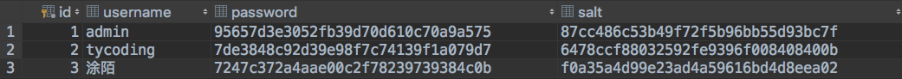
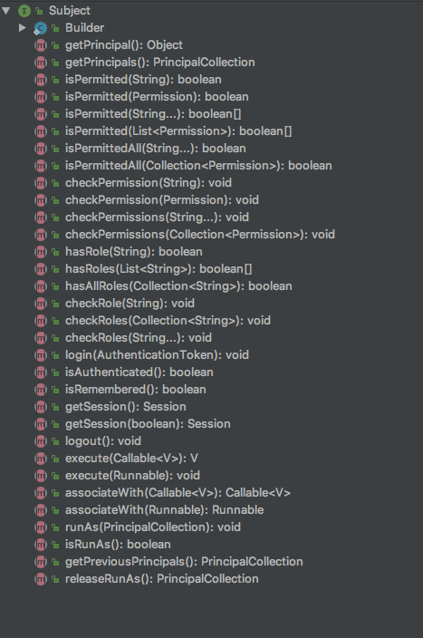
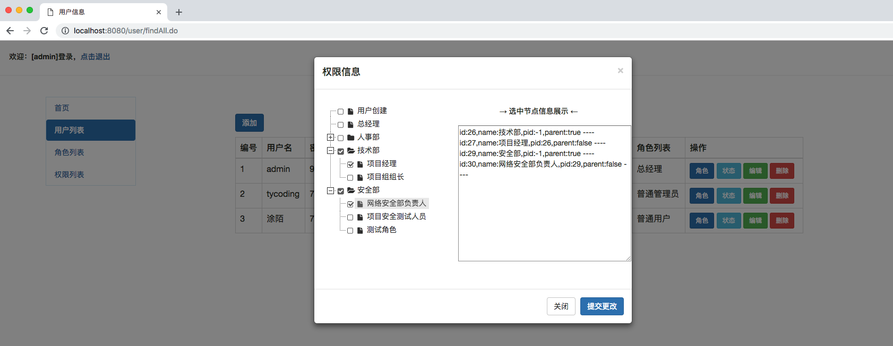

**手摸手教你SSM框架整合Shiro后的开发**

前面，我们学习了[Shiro实现权限管理之表结构设计](http://tycoding.cn/2018/09/15/shiro-database/)以及[JQuery-Ztree.js使用范例](http://tycoding.cn/2018/09/17/ztree/) ，接下来就详细介绍一下SSM框架整合Shiro框架后的开发。同样推荐大家参看张开涛老师的 [跟我学Shiro](jinnianshilongnian.iteye.com/blog/2049092) ，或者可以看我的笔记：[Shiro实现授权](http://tycoding.cn/2018/07/08/shiro-3/#more)、[Shiro实现身份认证](http://tycoding.cn/2018/07/07/shiro-2/#more)。

如果你对SSM框架的整合不是很熟悉，你或许可以参看我的这个项目[SSM框架整合](https://github.com/TyCoding/ssm)。

下面我们就开始实现一个SSM+Shiro的权限管理项目吧！


如果你觉得写的不错，那就点亮右上角小星星吧 (●´∀｀●)ﾉ

</br>

**测试环境**

> IDEA + Tomcat8 + Maven

写在前面：注意 注意 注意

当你把项目中`/db/`下的SQL文件执行后发现用户表中已经存在了几个用户，且密码都是经过加密的，这是我之前测试就创建的用户，具体的测试类请看 [UserTest.java](https://github.com/TyCoding/shiro/blob/master/src/test/UserTest.java)。
其中模拟创建了三个用户，对应的用户名密码如下：

```
admin  -->  123
tycoding  -->  123
涂陌  -->  123
```

项目中文档也写的很详细呀，仔细看看文档呗！当然当然，我自己也是个菜鸡，文档难免有些错误和片面，大家作为基础的入门参考就行了，想要系统的学习可以看一些权限管理项目，就先说到这吧！


# 起步

初始化数据库，请参考[/db](https://github.com/TyCoding/shiro/tree/master/db)中的代码

## 导入依赖
导入Shiro框架需要的依赖：

> shiro-core-1.3.2.jar
> shiro-ehcache-1.3.2.jar
> shiro-quartz-1.3.2.jar
> shiro-spring-1.3.2.jar
> shiro-web-1.3.2.jar

其他依赖请参看项目中的[pom.xml](https://github.com/TyCoding/shiro/blob/master/pom.xml) 文件

## 搭建SSM框架

搭建SSM框架的过程这里不再详细说了，可以参看我的[SSM框架整合案例](https://github.com/TyCoding/ssm)

<br/>

# SSM框架整合Shiro

## 环境配置

### 1.在web.xml中配置Shiro的过滤器
与Spring集成：
```xml
<filter>
    <filter-name>shiroFilter</filter-name>
    <filter-class>org.springframework.web.filter.DelegatingFilterProxy</filter-class>
    <async-supported>true</async-supported>
    <init-param>
        <param-name>targetFilterLifecycle</param-name>
        <param-value>true</param-value>
    </init-param>
</filter>
<filter-mapping>
    <filter-name>shiroFilter</filter-name>
    <url-pattern>/*</url-pattern>
</filter-mapping>
```
和SpringMVC框架类似，Shiro框架也需要在web.xml中配置一个过滤器。`DelegatingFilterProxy`会自动到Spring容器中name为`shiroFilter`的bean，并且将所有Filter的操作都委托给他管理。

这就要求在Spring配置中必须注入这样一个这样的Bean：
```xml
<bean id="shiroFilter" class="org.apache.shiro.spring.web.ShiroFilterFactoryBean"></bean>
```
此处bean的`id`和`web.xml`中Shiro过滤器的名称`<filter-name>`必须是相同的，否则Shiro会找不到这个Bean。

### 2.spring-shiro-web.xml

```xml
<?xml version="1.0" encoding="UTF-8"?>
<beans xmlns="http://www.springframework.org/schema/beans"
       xmlns:util="http://www.springframework.org/schema/util"
       xmlns:xsi="http://www.w3.org/2001/XMLSchema-instance"
       xsi:schemaLocation="
       http://www.springframework.org/schema/beans http://www.springframework.org/schema/beans/spring-beans.xsd
       http://www.springframework.org/schema/util http://www.springframework.org/schema/util/spring-util.xsd">

    <!-- Shiro的Web过滤器 -->
    <bean id="shiroFilter" class="org.apache.shiro.spring.web.ShiroFilterFactoryBean">
        <!-- Shiro的安全管理器，所有关于安全的操作都会经过SecurityManager -->
        <property name="securityManager" ref="securityManager"/>
        <!-- 系统认证提交地址，如果用户退出即session丢失就会访问这个页面 -->
        <property name="loginUrl" value="/login.jsp"/>
        <!-- 权限验证失败跳转的页面，需要配合Spring的ExceptionHandler异常处理机制使用 -->
        <property name="unauthorizedUrl" value="/unauthorized.jsp"/>
        <property name="filters">
            <util:map>
                <entry key="authc" value-ref="formAuthenticationFilter"/>
            </util:map>
        </property>
        <!-- 自定义的过滤器链，从上向下执行，一般将`/**`放到最下面 -->
        <property name="filterChainDefinitions">
            <value>
                <!-- 静态资源不拦截 -->
                /static/** = anon
                /lib/** = anon
                /js/** = anon

                <!-- 登录页面不拦截 -->
                /login.jsp = anon
                /login.do = anon

                <!-- Shiro提供了退出登录的配置`logout`，会生成路径为`/logout`的请求地址，访问这个地址即会退出当前账户并清空缓存 -->
                /logout = logout

                <!-- user表示身份通过或通过记住我通过的用户都能访问系统 -->
                /index.jsp = user

                <!-- `/**`表示所有请求，表示访问该地址的用户是身份验证通过或RememberMe登录的都可以 -->
                /** = user
            </value>
        </property>
    </bean>

    <!-- 基于Form表单的身份验证过滤器 -->
    <bean id="formAuthenticationFilter" class="org.apache.shiro.web.filter.authc.FormAuthenticationFilter">
        <property name="usernameParam" value="username"/>
        <property name="passwordParam" value="password"/>
        <property name="loginUrl" value="/login.jsp"/>
    </bean>
    
    <!-- 安全管理器 -->
    <bean id="securityManager" class="org.apache.shiro.web.mgt.DefaultWebSecurityManager">
        <property name="realm" ref="userRealm"/>
    </bean>

    <!-- Realm实现 -->
    <bean id="userRealm" class="cn.tycoding.realm.UserRealm"></bean>
</bean>
```

上面配置文件的核心处就是Shiro的web过滤器的配置，当然因为Shiro的所有涉及安全的操作都要经过`DefaultWebSecurityManager`安全管理器，所以`shiroFilter`首先就要将其交给`SecurityManager`管理。`loginUrl`是账户退出或者session丢失就跳转的地址；`unauthorizedUrl`是账户权限验证失败跳转的地址，比如账户权限不够等；然后就是过滤器链`filterChainDefinitions`的配置，他和我们之前配置的`.ini`文件非常相似，其中主要就是配置资源的的拦截。Shiro提供了很多默认的拦截器，比如什么验证，授权等，这里举例几个比较常用的默认拦截器：

<style>
table th:first-of-type {
    width: 100px;
}
</style>

| 默认拦截器名 | 说明 |
| -- | -- |
| authc | 基于表单的拦截器，比如若用户没有登录就会跳转到`loginUrl`的地址，其拦截的请求必须是通过登录验证的，即`Subject.isAuthenticated() == true`的账户才能访问 |
| anon | 匿名拦截器，和`authc`拦截器刚好作用相反。`anon`配置的请求允许用户为登录就等访问，一般我们配置登录页面和静态CSS等资源是允许匿名访问 |
| logout | 退出拦截器，Shiro提供了一个退出的功能，配置了`/logout = logout`，Shiro就会生成一个虚拟的映射路径，当用户访问了这个路径，Shiro会自动清空缓存并跳转到`loginUrl`页面 | 
| user | 用户拦截器，和`authc`拦截器很类似，都是账户为登录的进行拦截并跳转到`loginUrl`地址；不同之处在于`authc`允许账户必须是通过`Subject.siAuthenticated() ==true`的；而`user`不仅允许登录账户访问，通过rememberMe登录的用户也能访问 |

## Shiro实现身份认证

**身份认证的流程**

如果用户为登录，将跳转到`loginUrl`进行登录，登录表单中，包含了两个主要参数：用户名`username`、密码`password`（这两个参数名称不是固定的，但是要和`FormAuthenticationFilter`表单过滤器的参数配置要对应）。

1. 用户输入这两个用户名和密码后提交表单，通过绑定了SecurityManager的SecurityUtils得到Subject实例，然后获取身份验证的`UsernamePasswordToken`传入用户名和密码。
2. 调用`subject.login(token)`进行登录，SecurityManager会委托`Authenticator`把相应的token传给Realm，从Realm中获取身份认证信息。
3. Realm可以是自己实现的Realm，Realm会根据传入的用户名和密码去数据库进行校验（提供Service层登录接口）。
4. Shiro从Realm中获取安全数据（如用户、身份、权限等），如果校验失败，就会抛出异常，登录失败；否则就登录成功。

```java
@Controller
public class LoginController {
    @RequestMapping("/login")
    public String login(
            @RequestParam(value = "username", required = false) String username,
            @RequestParam(value = "password", required = false) String password,
            Model model) {
        String error = null;
        if (username != null && password != null) {
            //初始化
            Subject subject = SecurityUtils.getSubject();
            UsernamePasswordToken token = new UsernamePasswordToken(username, password);
            try {
                //登录，即身份校验，由通过Spring注入的UserRealm会自动校验输入的用户名和密码在数据库中是否有对应的值
                subject.login(token);
                return "redirect:index.do";
            }catch (Exception e){
                e.printStackTrace();
                error = "未知错误，错误信息：" + e.getMessage();
            }
        } else {
            error = "请输入用户名和密码";
        }
        //登录失败，跳转到login页面，这里不做登录成功的处理，由
        model.addAttribute("error", error);
        return "login";
    }
}
```

**拓展**

如上，当`login()`映射方法得到用户输入的用户名和密码后调用`subject.login(token)`进行登录，随后就是通过Realm进行登录校验，如果登录失败就可能抛出一系列异常，比如`UnknownAccountException`用户账户不存在异常、`IncorrectCredentialsException`用户名或密码错误异常、`LockedAccountException`账户锁定异常... 。

可能，你也看到有些示例中在Controller层中没有处理登录成功，而是在`ShiroFilterFactoryBean`中配置`successUrl`，很多博文中讲到：如果登录成功Shiro会自动跳转到登录前访问的地址，如果找不到登录前访问的地址，就会跳转到`successUrl`中配置的地址；But，我在测试中并没有看到这种特性，大家可以研究一波。


### 认证相关的拦截器
与登录认证相关的拦截器在前面`spring-shiro-web`配置文件中已经讲到了。主要是使用Shiro提供的默认拦截器配置请求资源资源的拦截和验证，如：

```xml
<!-- 静态资源不拦截 -->
/static/** = anon
/lib/** = anon
/js/** = anon

<!-- 登录页面不拦截 -->
/login.jsp = anon
/login.do = anon

...
```

运行项目，如果用户没有输入用户名和密码或者输入的用户名或密码有误等，将会抛出异常并重新跳转到`loginUrl`地址上，如果正确输入用户名和密码（数据库中存在的）将跳转到系统首页`index.do`。那么：我们在Controller仅仅调用了`subject.login(token)`，Shiro是怎样进行登录验证的呢？

那我们就要分析一下自定义的Realm了：

```java
public class UserRealm extends AuthorizingRealm {
    @Autowired
    private UserService userService;

    /**
     * 权限校验
     */
    protected AuthorizationInfo doGetAuthorizationInfo(PrincipalCollection principals) {
        SimpleAuthorizationInfo authorizationInfo = new SimpleAuthorizationInfo();
        return authorizationInfo;
    }

    /**
     * 身份校验
     */
    protected AuthenticationInfo doGetAuthenticationInfo(AuthenticationToken token) throws AuthenticationException {
        String username = (String) token.getPrincipal();
        User user = userService.findByName(username);
        if (user == null) {
            throw new UnknownAccountException(); //没有找到账号
        }
        if (Boolean.TRUE.equals(user.getLocked())) {
            throw new LockedAccountException(); //账号锁定
        }
        //交给AuthenticationRealm使用CredentialsMatcher进行密码匹配
        SimpleAuthenticationInfo authenticationInfo = new SimpleAuthenticationInfo(
                user.getUsername(), //用户名
                user.getPassword(), //密码
                getName() //realm name
        );
        return authenticationInfo;
    }
}
```
Shiro从Realm中获取安全数据，我们可以自定义多个Realm实现，但都要在SecurityManager中定义。一般我们自定义实现的Realm继承AuthorizingRealm（授权）即可，它继承了AuthenticatingRealm（身份验证）；所以自定义Realm一般存在两个最主要的功能：1.身份验证；2.权限校验。

在用户登录后，Controller会接收到用户输入的用户名和密码，并调用`subject.login(token)`进行登录，实际上SecurityManager会委托`Authenticator`调用自定义的Realm进行身份验证。要知道，调用Realm传入的并不直接是用户名和密码，而是在Controller中绑定了用户名和密码的Token对象，那么你首先要清楚身份验证中两个重要的参数：

<style>
table th:first-of-type {
    width: 100px;
}
</style>

| 属性名称 | 作用 |
| -- | -- |
| principals | 身份，主体的唯一标识，比如用户名、邮箱等，如果你将用户名和密码传给了Token对象，那么在Token对象中就能`getPrincipal`获取这个标识 |
| credentials | 证明、凭证。比如密码、数字证书等。但是在Shiro等安全框架中，类似于密码这种数据一般都是经过加密处理的，它肯能不单单是密码的数据，后面讲 |

了解了上述两个参数后，下面自然是从token对象中调用`token.getPrincipal()`获取用户名，然后调用Service层方法根据这个用户名查询数据库中是否存在一个密码与其对应，根据返回的User对象，最后通过Shiro提供的`SimpleAuthenticationInfo`进行密码匹配。`SimpleAuthenticationInfo`存在多个构造方法：

```java
public SimpleAuthenticationInfo(Object principal, Object credentials, String realmName) {}

public SimpleAuthenticationInfo(Object principal, Object hashedCredentials, ByteSource credentialsSalt, String realmName) {}

public SimpleAuthenticationInfo(PrincipalCollection principals, Object credentials) {}

public SimpleAuthenticationInfo(PrincipalCollection principals, Object hashedCredentials, ByteSource credentialsSalt) {}
```

`SimpleAuthenticationInfo`类提供了多个构造方法，但是一般而言我们的密码是经过加密的（后面讲）；如此Shiro会自动根据token中的用户名和密码与从数据库中查询到的数据进行匹配，如果匹配成功就登录成功，否者就抛出异常。

### 注销（退出）

注销登录就简单很多了，在以前我们都是手动写一个请求映射方法，当用户调用这个请求的时候，手动清空Session，但是在Shiro中，这些步骤都省略了，我们只需要在配置文件Shiro的过滤器`shiroFilter`中过滤器链`filterChainDefinitions`中的`<value>`标签中配置这一行：

```xml
/logout = logout
```

即可。Shiro会根据这个配置生成一个虚拟的请求映射路径，当用户请求`localhost:8080/logout`这个接口的时候，Shiro会自动清空Session，并跳转到`loginUrl`指定的地址。

## Shiro实现密码加密和解密

常见的加密方式有很多，这里我们介绍Shiro中提供的一套散列算法加密方式。散列算法，是一种不可逆的算法（自然是要不可逆的，因为可逆的算法破解起来也很容易，所以不可逆的算法更安全），常见的散列算法如MD5，、SHA，但是我们再网上看到很多破解MD5加密的网站，不是说散列算法是不可逆的吗？为什么还存在那么多破解密码的网站？其实散列算法确实是不可逆的，即使是常见的MD5加密也是不可逆的加密方式，而网上的破解网站并不是能够逆向算出这个加密密码，而是通过大数据的方式得出来的，相当于，MD5解密的网站中存在一个很大的数据库，里面存放了用户常见的加密密码，然后当用户再用此密码解密时，再从数据库中比对加密后的MD5密码，如果存在就能得到原密码了。为了避免这种情况，引入了盐`salt`的概念，如果能通过大数据的方式破解MD5的加密，但如果在加密的密码中再添加一组数据进行混淆，破解起来就相当难了，因为添加的`salt`只有我们自己知道是什么。

自定义一套散列算法：

1. 实例化一个RandomNumberGenerator对象生成随机数，可以用来设置盐值。
2. 设定散列算法的名称和散列迭代次数。
3. 调用`SimpleHash()`构造方法，将算法名称、用户输入的密码、盐值、迭代次数传入。
4. 通过`SimpleHash()`构造方法，Shiro能自动帮我们对密码进行加密，并调用实体类对象的`setter`方法将密码设置进去。

```java
@Component
public class PasswordHelper {

    //实例化RandomNumberGenerator对象，用于生成一个随机数
    private RandomNumberGenerator randomNumberGenerator = new SecureRandomNumberGenerator();
    //散列算法名称
    private String algorithName = "MD5";
    //散列迭代次数
    private int hashInterations = 2;
    //加密算法
    public void encryptPassword(User user){
        if (user.getPassword() != null){
            //对user对象设置盐：salt；这个盐值是randomNumberGenerator生成的随机数，所以盐值并不需要我们指定
            user.setSalt(randomNumberGenerator.nextBytes().toHex());

            //调用SimpleHash指定散列算法参数：1、算法名称；2、用户输入的密码；3、盐值（随机生成的）；4、迭代次数
            String newPassword = new SimpleHash(
                    algorithName,
                    user.getPassword(),
                    ByteSource.Util.bytes(user.getCredentialsSalt()),
                    hashInterations).toHex();
            user.setPassword(newPassword);
        }
    }

    //getter/setter ....
}
```
如上，在`encryptPassword`中进行了核心的密码加密过程，我们只需要调用`SimpleHash()`传入需要加密的参数即可，但是在这里你应该会注意到两个地方：`user.setSalt()`和`user.getCredentialsSalt()`。
其实，在实体类中我们的确定义了一个属性`private String salt;`，这里调用的`setSalt()`正是向其中设置`RandomNumberGenerator`生成的随机数作为盐值；但是又矛盾了，为什么还存在一个`getCredentialsSalt()`方法？

那么我们看一下`SimpleHash`的构造方法：

```java
public SimpleHash(String algorithmName, Object source, Object salt, int hashIterations) throws CodecException, UnknownAlgorithmException {}
```

其中也需要一个参数`salt`。但是，要注意此salt非彼salt；我们先看一下User实体类中定义的`getCredentialsSalt()`方法：

```java
private String salt; //盐

public String getCredentialsSalt() {
    return username + salt;
}

//getter/setter...
```

意义就是指定之后要使用的盐值`salt`实际上是`username`和`salt`的组合体，但是你肯定好奇，为什么又定义`getCredentialsSalt()`呢？
要区分：`setSalt()`是为User实体了设置salt参数的值，salt的值本就是`RandomNumberGenerator`生成的随机数；但是`getCredentialsSalt()`得到的盐值是`用户名+随机数`，这个值最终成为了`SimpleHash`加密密码的一个重要组成部分，那么最终通过指定加密方式（这里是MD5）加密的密码由`用户名+随机数+密码`组合而得。

### 加密
上面介绍了核心的加密流程，那么如何使用？什么时候需要加密呢？

固然是在创建新用户的时候加密用户密码了，那么我们来看下创建用户的Service层：
```java
public void create(User user) {
  //加密密码
  passwordHelper.encryptPassword(user);
  userDao.create(user);
}
```
创建用户时，要调用`passwordHelper`的`encryptPassword()`方法对传入的User对象进行密码加密和设定盐值处理。那么在数据库中保存的数据就如：



除了创建用户，更新用户数据的时候也要重新加密密码（只要更新了User表的用户名或密码）都必须调用`encryptPassword()`重新加密密码和设置盐值，因为最终存在数据库表中的密码是`用户名+密码+盐值`。

```java
public void update(User user) {
    //加密密码
    passwordHelper.encryptPassword(user);
    userDao.update(user);
}
```

### 解密
上面讲了半天的加密过程，下面说一下解密实现。之前已经说过，散列算法是不可逆的，所以一旦密码被加密是无法算出来的，但是我们可以用另外一种方式：比对。就是将散列算法的加密方式传给Realm，当用户登录系统时，获取用户输入的密码根据已定义的加密方式对此密码进行加密，然后交给`SimpleAuthenticationInfo`将用户登录输入的加密密码和数据库中根据username得到的加密密码进行比对，如果比对成功就证明你的登录密码是正确的，从而实现解密。

那么应该怎么实现？很简单，在Realm中我们应该调用`SimpleAuthenticationInfo`的这个构造方法：

```java
public SimpleAuthenticationInfo(Object principal, Object hashedCredentials, ByteSource credentialsSalt, String realmName) {}
```

那么我们要更改Realm中的`SimpleAuthenticationInfo`的这个实现：

```java
SimpleAuthenticationInfo authenticationInfo = new SimpleAuthenticationInfo(
    user.getUsername(), //用户名
    user.getPassword(), //密码
    ByteSource.Util.bytes(user.getCredentialsSalt()), //salt=username+salt
    getName() //realm name
);
```

如果使用了散列算法进行密码加密和验证服务，你必须在Spring配置文件中注入`credentialsMatcher`来实现密码验证服务。

```xml
<bean id="credentialsMatcher" class="cn.tycoding.credentials.RetryLimitHashedCredentialsMatcher">
  <constructor-arg ref="cacheManager"/>
  <property name="hashAlgorithmName" value="md5"/>
  <property name="hashIterations" value="2"/>
  <property name="storedCredentialsHexEncoded" value="true"/>
</bean>
```

创建一个`RetryLimitHashedCredentialsMatcher`类，继承`HashedCredentialsMathcer`

```java
public class RetryLimitHashedCredentialsMatcher extends HashedCredentialsMatcher {
    public RetryLimitHashedCredentialsMatcher(CacheManager cacheManager){}

    public boolean doCredentialsMatch(AuthenticationToken token, AuthenticationInfo info) {}
}
```

这样就能获取到加密密码的盐值，然后`SimpleAuthenticationInfo`会结合这个盐值进行密码比对实现解密。


<br/>

## Shiro实现授权

授权，即赋予用户一定的操作权限，这时，就该参考一下项目的表设计了： [Shiro实现权限管理系统之表结构设计](http://tycoding.cn/2018/09/15/shiro-database/#more) 。结合数据库的表设计我们似乎就清楚了为什么那样设计表，根据什么进行权限校验和授权，想必你也有一些思路了。

在授权中需要了解几个关键对象：

<style>
table th:first-of-type {
    width: 100px;
}
</style>

| 对象名称 | 作用 |
| -- | -- |
| 主体(Subject) | 即代表当前登录的用户 |
| 资源(Resource) | 即用户登录成功后允许访问的东西，比如某个页面，某个文件；它可以精确到某个按钮等.. |
| 权限(Permission) | 即代表用户操作系统功能的权利，如果拥有了这个权限才能操作该功能，和资源关联，有权限就意味着有访问资源的权利 |
| 角色(Role) | 代表了操作（资源）集合，可以理解为权限的集合，和权限关联，角色对应的权限，权限关联着资源 | 

所以，我们要清楚：用户和角色间是一对多的关系；角色和权限是多对多的关系；权限和资源是多对多的关系。但是在我们设计的表：[Shiro实现权限管理系统之表结构的设计](http://tycoding.cn/2018/09/15/shiro-database/#more)中，我并没有设置单独设置资源表，而是仅用了权限表。
当然你可以再写一个资源表(Resource)，建立权限和资源间的关系，这样权限管理能精确到对每个按钮的管理。

### 授权
实现授权前，首先，用户得拥有权限，那么就要建立用户-角色的关系、角色-权限的关系；具体操作步骤请参看我的这篇博文：[Shiro实现权限管理系统之表结构设计](http://tycoding.cn/2018/09/15/shiro-database/#more)中介绍的sql。

Shiro提供了多种授权方式，比如我们可以看subject实例拥有的授权方法：



从方法名上就能看出`subject`提供了哪些授权方式；那么这里我们不讲用`subject`实例授权的方式，我们讲一种更简便的方式：Shiro注解、Shiro-Spring注解的方式。

Shiro结合Spring提供了相应的注解用户权限控制，我们先来看一下都有哪些注解：

<style>
table th:first-of-type {
    width: 100px;
}
</style>

| 注解名称 | 解释 |
| -- | -- |
| @RequiresAuthentication | 表示当前Subject已经通过login身份验证；即Subject.isAuthenticated() == true；否则就拦截 |
| @RequiresUser | 表示当前Subject已经通过login身份验证或通过记住我登录；否则就拦截 | 
| @RequiresGuest | 表示当前Subject没有身份验证或通过记住我登录过，即是游客身份 |
| @RequiresRoles(value ={"admin", "user"}, logical=Logical.AND) | 表示当前Subject需要同时（由Logical.AND体现）拥有admin和user角色；否则拦截 |
| @RequiresPermissions(vale={"user:a","user:b"}, logical=Logical.OR) | 表示当前Subject需要拥有`user:a`或者（由Logical.OR体现）`user:b`角色；否则拦截 |

因为Shiro的某些权限注解需要AOP的功能进行判断，所以需要开启AOP功能的支持；项目中使用了Spring AOP，Shiro提供了Spring AOP的集成用于权限注解的解析和验证。
在SpringMVC的配置文件中开启Shiro Spring AOP 的支持：

```xml
<aop:config proxy-target-class="true"/>
<bean class="org.apache.shiro.spring.security.interceptor.AuthorizationAttributeSourceAdvisor">
    <property name="securityManager" ref="securityManager"/>
</bean>
```

### 在Controller映射方法上添加注解

创建用户的方法上添加权限注解：

```java
@ResponseBody
@RequestMapping("/create")
@RequiresRoles(value={"admin","personnel-resource"}, logical = Logical.OR)
public Result create(@RequestBody User user) {}
```


删除用户信息的方法上添加权限注解：

```java
@ResponseBody
@RequestMapping("/delete")
@RequiresRoles(value = {"admin", "personnel-resource"}, logical = Logical.OR)
public Result delete(@RequestParam("id") Long id){}
```


根据用户名查找其角色的方法上添加权限注解：

```java
@ResponseBody
@RequestMapping("/findRoles")
@RequiresRoles(value = {"admin"}, logical = Logical.OR)
@RequiresPermissions(value = {"role:view", "role:*"}, logical = Logical.OR)
public List<Role> findRoles(String username) {}
```

...

### JSP页面授权

Shiro提供了JSTL标签用于在JSP/GSP页面进行权限控制；首先需要导入标签库：

```html
<%@ taglib prefix="c" uri="http://java.sun.com/jsp/jstl/core" %>
```

<style>
table th:first-of-type {
    width: 100px;
}
</style>

| 标签名称 | 作用 |
| -- | -- |
| <shiro:guest> | 用户没有身份验证时显示相应的信息，即游客访问信息 |
| <shiro:user> | 用户已经身份验证、记住我登录后显示相应的信息，未登录用户将会拦截 |
| <shiro:authenticated> | 用户已经身份验证通过，即Subject.isAuthenticated() == true；未登录或记住我登录的都会拦截 |
| <shiro:notAuthenticated> | 用户已经身份验证通过，但是Subject.isAuthenticated() == false，即可能是通过记住我登录的 |
| <shiro:principal> | 显示用户身份信息，默认调用Subject.getPrincipal()获取用户登录信息 |
| <shiro:hasRole> | 如：`<shiro:hasRole name="admin">`，如果当前Subject有admin角色就显示数据，类似于`@RequiresRoles()`注解；否则就拦截 |
| <shiro:hasAnyRole> | 如：`<shiro:hasAnyRole name="admin,user">`，如果当前Subject有admin或user角色就显示数据，类似于`@RequireRoles(Logical=Logical.OR)`注解；否则将就拦截 |
| <shiro:lackRole> | 如果当前Subject没有角色就显示数据 |
| <shiro:hasPermission> | 如：`<shiro:hasPermission name="user:create">`，如果当前Subject有`user:create`权限，就显示数据；否则就拦截 |
| <shiro:lacksPermission> | 如：`<shiro:lacksPermission name="user:create">`，如果当前Subject没有`user:create`权限，就显示数据；否则拦截 |

<br/>

## Shiro实现会话管理

会话：用户登录后直至注销（Session丢失）前称为一次会话，即用户访问应用时保持的连接关系，可以保证在多次交互中应用能够识别出当前访问的用户是谁，且可在多次交互中保存一些数据。常见的应用实例如：登录时记住我的功能、单点登录的功能...

Shiro提供了会话管理器：`sessionManager`，管理着所有会话的创建、维护、删除、等工作。在web环境中使用Shiro的会话管理器，我们需要在Spring的配置文件中注入`DefaultWebSessionManager`:

```xml
<bean id="sessionManager" class="org.apache.shiro.web.session.mgt.DefaultWebSessionManager">
    <!-- 设置全局会话过期时间：默认30分钟 -->
    <property name="globalSessionTimeout" value="1800000"/>
    <!-- 是否启用sessionIdCookie，默认是启用的 -->
    <property name="sessionIdCookieEnabled" value="true"/>
    <!-- 会话Cookie -->
    <property name="sessionIdCookie" ref="sessionIdCookie"/>    
</bean>

<!-- 会话Cookie模板 -->
<bean id="sessionIdCookie" class="org.apache.shiro.web.servlet.SimpleCookie">
    <constructor-arg value="sid"/>
   <!-- 如果设置为true，则客户端不会暴露给服务端脚本代码，有助于减少某些类型的跨站脚本攻击 -->
    <property name="httpOnly" value="true"/>
    <property name="maxAge" value="-1"/><!-- maxAge=-1表示浏览器关闭时失效此Cookie -->
</bean>
```

还要将`sessionManager`注入到`SecurityManager`中：

```xml
<bean id="securityManager" class="org.apache.shiro.web.mgt.DefaultWebSecurityManager">
    <property name="realm" ref="userRealm"/>
    <!-- 注入sessionManager -->
    <property name="sessionManager" ref="sessionManager"/>
</bean>
```

## Shiro缓存实现

Shiro也集成了缓存机制，例如Shiro提供了CachingRealm，提供了一些基础的缓存实现。Shiro默认是禁用缓存的，首先我们要开启Shiro的缓存管理，在XML中进行如下配置：

```xml
<bean id="cacheManager" class="org.apache.shiro.cache.ehcache.EhCacheManager">
    <property name="cacheManagerConfigFile" value="classpath:other/ehcache.xml"/>
</bean>
```

在自定义的Realm实现中配置缓存的实现：
```xml
<!-- Realm实现 -->
<bean id="userRealm" class="cn.tycoding.realm.UserRealm">
    <!-- 使用credentialsMatcher实现密码验证服务 -->
    <property name="credentialsMatcher" ref="credentialsMatcher"/>
    <!-- 是否启用缓存 -->
    <property name="cachingEnabled" value="true"/>
    <!-- 是否启用身份验证缓存 -->
    <property name="authenticationCachingEnabled" value="true"/>
    <!-- 缓存AuthenticationInfo信息的缓存名称 -->
    <property name="authenticationCacheName" value="authenticationCache"/>
    <!-- 是否启用授权缓存，缓存AuthorizationInfo信息 -->
    <property name="authorizationCachingEnabled" value="true"/>
    <!-- 缓存AuthorizationInfo信息的缓存名称 -->
    <property name="authorizationCacheName" value="authorizationCache"/>
</bean>
```

在`resources/other/`文件夹下创建配置文件`ehcache.xml`：
```xml
<?xml version="1.0" encoding="UTF-8"?>
<ehcache name="shirocache">
    <cache name="shiro-activeSessionCache"
           maxEntriesLocalHeap="2000"
           eternal="false"
           timeToIdleSeconds="3600"
           timeToLiveSeconds="0"
           overflowToDisk="false"
           statistics="true">
    </cache>
</ehcache>
```

设置SecurityManager的cacheManager：

```xml
<bean id="securityManager" class="org.apache.shiro.web.mgt.DefaultWebSecurityManager">
    <property name="cacheManager" ref="cacheManager"/>
    ...
</bean>
```

## 实现Remember功能

在Shiro会话管理时我们就讲到会话的功能，例如：Shiro实现了RememberMe记住我的功能，当用户在登录页面中勾选了记住我，再浏览器关闭后再次访问系统发现是可以直接登录的；但是如果没有实现这一功能，Shiro默认设置浏览器关闭后立即清除缓存，那么再次打开浏览器要重新进行登录。

- 拓展

RememberMe和使用`Subject.login(token)`登录是有所不同的，RememberMe是使用缓存Cookie的技术实现的登录，在前面讲到的一些权限注解中就说到了两者的区别。

- RememberMe的配置实现

在配置文件中写入：

```xml
<!-- 会话Cookie模板 -->
<bean id="sessionIdCookie" class="org.apache.shiro.web.servlet.SimpleCookie">
    <constructor-arg value="sid"/>
    <!-- 如果设置为true，则客户端不会暴露给服务端脚本代码，有助于减少某些类型的跨站脚本攻击 -->
    <property name="httpOnly" value="true"/>
    <property name="maxAge" value="-1"/><!-- maxAge=-1表示浏览器关闭时失效此Cookie -->
</bean>
<bean id="rememberMeCookie" class="org.apache.shiro.web.servlet.SimpleCookie">
    <constructor-arg value="rememberMe"/>
    <property name="httpOnly" value="true"/>
    <property name="maxAge" value="2592000"/><!-- 30天 -->
</bean>

<!-- rememberMe管理器 -->
<bean id="rememberMeManager" class="org.apache.shiro.web.mgt.CookieRememberMeManager">
    <!-- cipherKey是加密rememberMe Cookie的密匙，默认AES算法 -->
    <property name="cipherKey" value="#{T(org.apache.shiro.codec.Base64).decode('4AvVhmFLUs0KTA3Kprsdag==')}"/>
    <property name="cookie" ref="rememberMeCookie"/>
</bean>
```

在`sessionIdCookie`中设置`maxAge=-1`表示浏览器关闭后即失效此Cookie在`rememberMeCookie`中设置`maxAge=2592000`表示记住此Cookie，保存30天。

在`SecurityManager`中设置`rememberMeManager`:

```xml
<bean id="securityManager" class="org.apache.shiro.web.mgt.DefaultWebSecurityManager">
        <property name="rememberMeManager" ref="rememberMeManager"/>
</bean>
```

### 测试

1. 修改login登录页面：

在登录表单中添加一个checkbox：

```html
<input type="checkbox" name="remember">请记住我
```
如果用户勾选了这个复选框，点击登录按钮提交后台的参数中会多一个`remember`参数，且值是`on`（如果用户没有勾选，提交表单中就不存在这个参数）；所以我们修改Controller的登录方法：

2. 修改Controller

```java
public String login(
            @RequestParam(value = "username", required = false) String username,
            @RequestParam(value = "password", required = false) String password,
            @RequestParam(value = "remember", required = false) String remember,
            Model model) {
  if (username != null && password != null) {
      //初始化
      Subject subject = SecurityUtils.getSubject();
      UsernamePasswordToken token = new UsernamePasswordToken(username, password);
      if (remember != null){
          if (remember.equals("on")) {
              //说明选择了记住我
              token.setRememberMe(true);
          } else {
              token.setRememberMe(false);
          }
      }else{
          token.setRememberMe(false);
      }
      try {
          //登录，即身份校验，由通过Spring注入的UserRealm会自动校验输入的用户名和密码在数据库中是否有对应的值
          subject.login(token);
          return "redirect:index.do";
      }catch (Exception e){
          e.printStackTrace();
          error = "未知错误，错误信息：" + e.getMessage();
      }
  } else {
      error = "请输入用户名和密码";
  }
  //登录失败，跳转到login页面
  model.addAttribute("error", error);
  return "login";
}
```

3. 创建一个测试页面

创建一个`authenticated.jsp`页面，随便写一段文字`此页面必须是Subject.isAuthenticated() == true才能访问`。然后在配置文件的`filterChainDefinitions`中定义

```xml
/authenticated.jsp = authc
```

4. 测试

启动项目，访问`localhost:8080/`自动跳转到登录页面，勾选登录表单中的记住我复选框，成功登录系统后，关闭浏览器。再次打开浏览器，直接访问`localhost:8080/index.do`发现直接就能登录系统。但是直接在浏览器中输入`localhost:8080/authenticated.jsp`发现确是不能访问的，并且被拦截道登录页面，原因就是rememberMe登录系统并不是通过`Subject.login(token)`的方式，而`authc`拦截器拦截的资源要求必须是`Subject.isAuthenticated() == true`才能访问。

重新启动项目（或者注销账户），重新进入登录页面，此次不勾选记住我复选框，成功进入系统后关闭浏览器，再次打开浏览器输入`localhost:8080/index.do`发现会再次被拦截跳转到`loginUrl`地址。

# 项目截图




<br/>

# 交流

如果大家有兴趣，欢迎大家加入我的Java交流群：671017003 ，一起交流学习Java技术。博主目前一直在自学JAVA中，技术有限，如果可以，会尽力给大家提供一些帮助，或是一些学习方法，当然群里的大佬都会积极给新手答疑的。所以，别犹豫，快来加入我们吧！

<br/>

# 联系

If you have some questions after you see this article, you can contact me or you can find some info by clicking these links.

- [Blog@TyCoding's blog](http://www.tycoding.cn)
- [GitHub@TyCoding](https://github.com/TyCoding)
- [ZhiHu@TyCoding](https://www.zhihu.com/people/tomo-83-82/activities)
